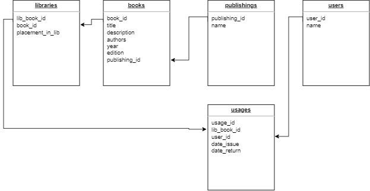

Тестовое задание для Golang разработчика от компании UDV 

Разработка REST API Web-сервиса с использованием gorilla/mux и gorm
Приложение для каталогизации книг (библиотека), модель данных должна учитывать следующую информацию:
- информацию о книге: заголовок, краткое описание, список автором, год, издание, издательство и т.п. (таблица-справочник)
- информация об издательстве (таблица-справочник)
- информация об экземплярах книги (количество и т.п.)
- информация о размещении экземпляров книг (например, номер стеллажа и др. данные, которые позволяют идентифицировать размещение)
- информация об пользователях библиотеки
- информация о статусе (выдана или нет, кому в данный момент выдана) в данном случае, для уровня выше джуниор должна быть реализована история выдачи экземпляра книги
Что необходимо реализовать:
1.	Подготовить модель данных и sql-скрипты для инициализации начальными данными для тестирования и проверки
2.	Для уровня Junior должны быть реализованы следующие REST API эндпоинты:
      GET /api/book/?page={page_number}&size={size} метод для получения списка книг с использование пэйджинации
      GET /api/book/{id} метод для получения одного объекта книги из справочника
      GET /api/book/{id}/items – метод для получения информации об экземплярах книги по идентификатору справочника

Запуск:
- docker-compose build
- docker-compose up

/Postman/UDV.postman_collection.json - Конфиг для тестирования API запросов через Postman

Схема БД:

API:
- GET /api/book/?page={page_number}&size={size} метод для получения списка книг с использование пэйджинации из libraries
- GET /api/book/{id} метод для получения одного объекта книги из справочника books
- GET /api/book/{id}/items – метод для получения информации об экземплярах книги по идентификатору справочника libraries
- GET /api/book/{id}/history - метод дя получения истории выдачи экземпляра книги по идетификатору справочника libraries

Исользовано:
- docker
- docker-compose
- gorilla/mux 
- gorm
- goose
